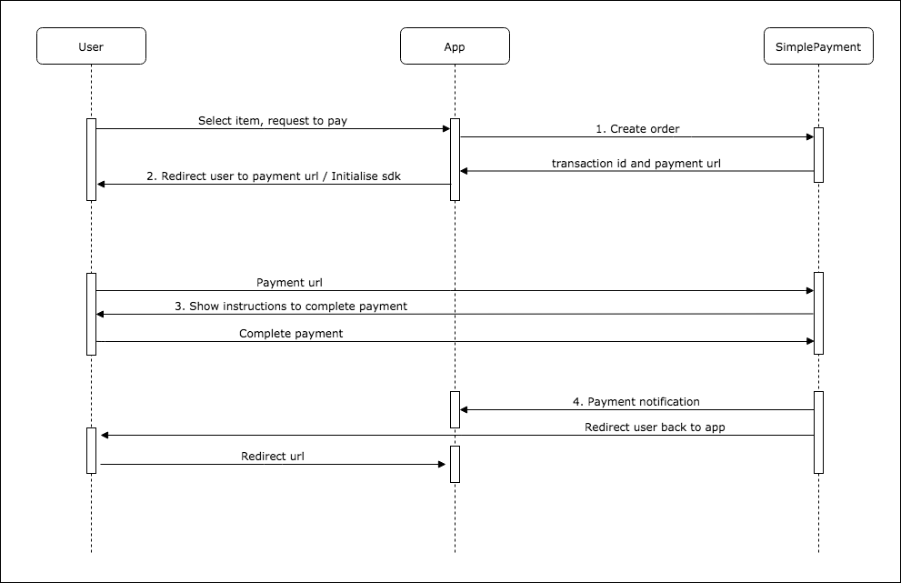

# General Flow

1. Create a payment order to get a transaction id in return
2. Redirect to a specified url or pass the transaction id into sdk
3. User complete the payment according to the instructions
4. Payment notification will be sent
5. Redirect user to your page.

# Web services Information

We are using RESTful API, and data is formatted in JSON.

### URL:

Sandbox : https://staging.simplepayment.solutions/

Production : https://api.simplepayment.solutions/

## Creating a payment order

### Request:

#### Method: POST

#### Endpoint: /api/v1/create

#### Request parameters ( in json ) :

| Name | Type | Length | Requirement | Description |
| -----| -----|-----| ---- | ---- |
| timestamp | bigint | - | Mandatory | unix time stamp, also known as POSIX time / epoch time, please synchronize your system clock with NTP pool, the difference between our servers has to be less than 600 seconds.  |
| user_id | string | 40 | Mandatory | Id of your user, can be email or running numbers |
| merchant\_transaction\_id | string | 128 | Mandatory | Merchant transaction identifier, must be unique for every order |
| transaction_description | string | 256 | Optional | A short description about this order |
| payment_channel | string | 30 | Mandatory | Payment channel of this order, full list is in Appendix section |
| currency | string | 3 | Mandatory | MYR, IDR, VND depending on the country of the payment channel|
| amount | integer | - | Mandatory | The price which user should pay |
| item_id | string | 40 | Optional | Item identifier, useful when you have different items with same price tab |
| item_name | string | 40 | Mandatory | The name of the item, it will be displayed in payment page or SMS |
| redirect_url | string | - | Optional | The url which the user will be redirected to after the payment, our id and payment status code will be added into the url, check Appendix section for details |
| custom | text | - | Optional | Extra identifier you wish to get in payment notification |

#### HTTP Headers:

| Name | Description |
| ---- | ----------- |
| Content-Type | application/json, The type of request content |
| AppId | Your **AppId** |
| Bodysign | Hash of request messsage, Appendix section will cover the calculation. |

### Response:

#### HTTP Headers: 

| Name | Description |
| ---- | ----------- |
| Content-Type | application/vnd.api+json |
| AppId | Your **AppId** |
| Bodysign | Hash of responded json, Appendix section will cover the calculation. |

You can identify if the request is successful by checking the root of the json. Successful case always use 'data' as root, while failed case is always 'errors'.

#### Body - Successful:

| Name | Description |
| ---- | ----------- |
| data | Top level or root of response |
| id | Our transaction identifier , work as a token as well, as it is only valid for 10 minutes. |
| status_code | The status code of this order |
| title | The status of this order |
| detail | The message of the status |
| href | The url to redirect the user, for web payment |
| rel | Target to the link |
| method | Method to use |

> example:
>
>>{"data":
{"id":"595962b31bc7e0056a5051ba","timestamp":1499030195,
"status_code":"ORDER_CREATED","title":"Order Created.",
"detail":"Payment order has been created.",
"links":
{"href":"http:\/\/payment.simplepayment.solutions\/order\/595962b31bc7e0056a5051ba",
"rel":"self","method":"GET"}}}"
}

#### Body - Error:

| Name | Description |
| ---- | ----------- |
| errors | Top level or root of response |
| id | error code, [click here](#error-codes) for the full list |
| title | The short description of error |
| detail | The description of error |
| code | http status code |
| links | Details of the error in web page ( reserved ) |

>example:
>
>> {"errors":
{"id":"INVALID\_APP\_ID","title":"The App id in request header is invalid.",
"detail":"The App id or client account is not found or has been deactivated.",
"code":400,"links":{"about":""}}}

## Payment Notification

Upon successful payment, payment notification will be sent to the payment notifcation url configured in our backend via POST method, we expect a **OK** ( string ) as response, to stop retrying. Pleae take note that **you may receive multiple payment notifications for a same transaction**.

The payment notifcation will be sent from 18.136.103.59 (development server) and 13.229.183.248 (production server) 

### Method: POST

### Request json

| Name | Description |
| ---- | --- |
| data | Top level or root of response |
| id | Our transaction identifier |
| timestamp | unix timestamp |
| details | array of transaction details |
 
### Array of transaction details

| Name | Description |
| ---- | --- |
| app_id | your AppId |
| user_id | User identifier, same as the one in order creation |
| merchant\_transaction_id | Your transaction id, same as the one in payment order
| transaction_description | Description of this transaction, if there is any |
| payment_channel | Payment channel that user used to complete this order, refer to Appendix for the complete list |
| channel_name | The name of the payment channel. |
| currency | The currency, only these: 'MYR', 'IDR', 'PHP' |
| amount | The total amount that user paid |
| status_code | The status of the transaction, Appendix section has the complete list |
| status | Short description of status_code. |
| item_id | Your item identifier |
| item_name | Your item name |
| testing | Testing status of this transaction, '1' or '0' |
| custom | the extra information submitted during order creation |

> example ( space is added to enable wraping ):
>
>> {"data":
{"id":"5b2e1344eef87c12b425f701","timestamp":1529746601,"details":{"app_id":"58c787cf398e82bea93ce070","user_id":1529746034,"merchant_transaction_id":"1529746034273349", 
"transaction_description":"","payment_channel":"airtime_testing","channel_name":"Airtime Testing",
"currency":"IDR","amount":10000,"status_code":"PAYMENT_COMPLETED",
"status":"Payment Completed", "item_id":"","item_name":"2000 coins",
"testing" : "1","custom":""}}
}

### Response ( in Text ):

> OK

## Order checking

### Request:

#### Method: POST

#### Endpoint: api/v1/check_order

#### Request parameters ( in json ) :

| Name | Type | Length | Requirement | Description |
| -----| -----|-----| ---- | ---- |
| id | string | - | Mandatory | our transaction id |
| timestamp | bigint | - | Mandatory | unix time stamp, also known as POSIX time / epoch time, please synchronize your system clock with NTP pool, the difference between our servers has to be less than 600 seconds.  |

#### HTTP Headers:

| Name | Description |
| ---- | ----------- |
| Content-Type | application/json, The type of request content |
| AppId | Your **AppId** |
| Bodysign | Hash of request messsage, Appendix section will cover the calculation. |

### Response ( in Json ):

#### HTTP Headers: 

| Name | Description |
| ---- | ----------- |
| Content-Type | application/vnd.api+json |
| AppId | Your **AppId** |
| Bodysign | Hash of responded json, Appendix section will cover the calculation. |

#### Body - Successful:

| Name | Description |
| ---- | --- |
| data | Top level or root of response |
| app_id | your AppId |
| user_id | User identifier, same as the one in order creation |
| merchant\_transaction_id | Your transaction id, same as the one in payment order
| transaction_description | Description of this transaction, if there is any |
| payment_channel | Payment channel that user used to complete this order |
| channel_name | The name of the payment channel. |
| currency | ISO 4217 Currency Codes, [click here](http://www.xe.com/iso4217.php) for the complete list |
| amount | The total amount that user paid |
| status_code | The status of the transaction, Appendix section has the complete list |
| status | Short description of status_code. |
| item_id | Your item identifier |
| item_name | Your item name |
| testing | Testing status of this transaction, '1' or '0' |
| custom | the extra information submitted during order creation |

> example ( space is added to enable wraping ):
>
>> {"data":
{"id":"5b2e1344eef87c12b425f701","timestamp":1529746601,"details":
{"app_id":"58c787cf398e82bea93ce070","user_id":1529746034,
"merchant_transaction_id":"1529746034273349", "transaction_description":"",
"payment_channel":"airtime_testing,"channel_name":"Airtime Testing",
"currency":"IDR","amount":10000,"status_code":"PAYMENT_COMPLETED",
"status":"Payment Completed", "item_id":"","item_name":"2000 coins",
"testing":"1","custom":""}}
}

#### Body - Error:

| Name | Description |
| ---- | ----------- |
| errors | Top level or root of response |
| id | error code, [click here] for the full list |
| title | The short description of error |
| detail | The description of error |
| code | http status code |
| links | Details of the error in web page ( reserved ) |

>example:
>
>> {"errors":
{"id":"INVALID\_APP\_ID","title":"The App id in request header is invalid.",
"detail":"The App id or client account is not found or has been deactivated.",
"code":400,"links":{"about":""}}
}

# Appendix

## Payment channel

| Name | Description | Amount range |
| --- | --- | --- |
| telkomsel_airtime | Airtime, Indonesia | IDR5.000, IDR10.000, IDR25.000, IDR50.000, IDR100.000 |
| indosat_airtime | Airtime, Indonesia | IDR5.000, IDR10.000, IDR25.000, IDR50.000, IDR100.000 |
| xl_airtime | Airtime, Indonesia | IDR5.000, IDR10.000, IDR25.000, IDR50.000, IDR100.000 |
| three_airtime | Airtime, Indonesia | IDR5000, IDR10000, IDR25.000, IDR50.000, IDR100.000 |
| bank_transfer | All bank transfer channels currency and amount, IDR50.000 ~ IDR20.000.000 |
| alfamart_otc | Over the counter of convenience store Alfamart, Indonesia | IDR10000 ~ Rp1.000.000 |
| indomaret_otc | Over the counter of convenience store Indomaret, Indonesia | IDR10000 ~ Rp1.000.000 |
| doku_wallet | Doku Wallet, Indonesia | IDR10.000 ~ IDR100.0000 |
| celcom_airtime | Airtime, Malaysia | MYR3, MYR20, MYR10, MYR20, MYR50 |
| digi_airtime | Airtime, Malaysia | MYR3, MYR5, MYR10, MYR20, MYR50 |
| maxis_airtime | Airtime, Malaysia | MYR3, MYR5, MYR10, MYR20, MYR50 |
| meps | Online Banking, Malaysia | MYR50 ~ MYR1000 |
| smart_airtime | Airtime, Philippines | PHP5, PHP10, PHP20, PHP50, PHP100 |
| globe_airtime | Airtime, Philippines | PHP5, PHP10, PHP20, PHP50, PHP100 |
| all | All payment channels, display selections according to currency and amount |
| default | All non-voucher payment channels, display selections according to currency and amount |
| airtime | All airtime channels, display selections according to currency and amount |
| wallet | All wallet channels, display selections according to currency and amount |
| voucher | All voucher channels, display selections according to currency and amount |
| airtime_testing | **For testing ONLY, please ignore any payment notification with such value after you go live.** To test: phone number: 088881234567, otp : 1234 | IDR10.000, IDR20.000, IDR25.000, IDR50.000, IDR100.000 |	

## Bodysign

To get the signature, take these steps:

1. base64 encode the json
> example ( space is added to enable wraping ):
>
>> json :
>
>> {"timestamp":1498954516,"amount":10000.00,"user_id":"test_user",
"item_name":"2000 coins","payment\_channel":"telkomsel\_airtime",
"redirect_url":"http:\/\/192.168.56.105\/callback\/payment", 
"redirect_target":"\_top","merchant_transaction_id":"1498954516427118"}
>
>> base64 : 
>
>> eyJ0aW1lc3RhbXAiOjE0OTg5NTQ1MTYsImFtb3VudCI6MTAwMD
AsInVzZXJfaWQiOiJ0ZXN0X3VzZXIiLC JpdGVtX25hbWUiOiIyMD
AwIGNvaW5zIiwicGF5bWVudF9jaGFubmVsIjoidGVsa29tc2VsX2F
pcnRpbWUiLCJ yZWRpcmVjdF91cmwiOiJodHRwOlwvXC8xOTIuMTY
4LjU2LjEwNVwvY2FsbGJhY2tcL3BheW1lbnQiLCJyZWRpcmVjdF90
YXJnZXQiOiJfdG9wIiwibWVyY2hhbnRfdHJhbnNhY3Rpb25faWQiO
iIxNDk4OTU0NTE2NDI3MTE4In0=

2. Calculate the hash using HMAC-SHA-256, using the **SecretKey** 
3. Example

> 
>> signature : 02978711eb15f52fb2d1c222c056293fd6f0348e28f6b8960d021e142c3a932f

## Redirect Url

Please avoid using 'transaction\_id' and 'status_code' in your redirect url, as they will be added into your redirect url.

>example:
>
>> https://www.domain.com/redirect?transaction\_id=5a586c21eed56c65b370bd74&status\_code=PAYMENT_PENDING
>> 

## Payment Status

Failed payment status will be updated as accurate as possbile, depending on upstream service provider.

| Code | Title | Description |
| ---- | --- | --- |
| PAYMENT\_COMPLETED | Payment Completed | This payment has been completed successfully, this is the **ONLY** payment status you should accept as payment successful. |
| ORDER\_CREATED | Order Created | Payment order has been created. |
| PAYMENT\_PENDING | Payment Pending | Waiting for user to complete the paymnet. |
| PAYMENT\_FAILED | Payment Failed | User does not complete the payment. |
| USED\_VOUCHER | Used Voucher | This voucher code has been used. |
| INVALID\_VOUCHER | Invalid Voucher | This voucher code is wrong. |
| PAYMENT\_REVERSED | Payment Reversed | Payment was reversed, timeout at switching network. |
| VERIFICATION\_FAILED | Verification Failed | Verification is not successul. |
| CHANNEL\_NOT_AVAILABLE | Channel is not available | Payment channel provider is unreachable. |
| INSUFFICIENT\_BALANCE | Insufficient Balance | Not enough balance to compelete the payment. |
| CHARGING\_REQUEST\_SENT | Charging Request Sent | Charging request has been submitted, payment notification will be sent if payment is successful. |
| CHARGING\_REQUEST\_FAILED | Charging Request Failed | Charging request has not been sent, please retry. |
| INVALID\_ACCOUNT | Invalid account | This account id is not found, please retry. |
| PAYMENT\_CANCELLED | Payment cancelled | User refuse to continue the payment. |
| PAYMENT\_EXPIRED | Payment expired | The time to complete payment has expired, please retry. |

## Error Codes
 
These are the error codes you may encounter while sending request to endpoints:

| Code | Description |
| ---- |  --- |
| INVALID\_APP\_ID | The App id in request header is invalid. |
| INVALID\_PAYLOAD | The payload is not json. |
| MISSING\_PARAMETERS | Some mandatory parameters are missing from the request. |
| DUPLICATED\_TRANS\_ID | This transacion id has been used, please make sure each payment request has unique transaction id. |
| PAYMENT\_UNDER\_MAINTENANCE | This payment channel is performing maintenance now. |
| INVALID\_PAYMENT\_METHOD| This payment method is not supported by this application. |
| INVALID\_DENOM | This payment method does not support this denomination. |

